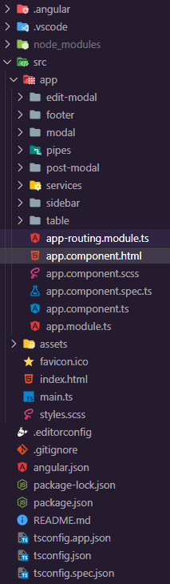

<h1 align="center"> Post de Sistemas Inteligentes en Red </h1>

 

## Tabla de contenidos:
---

- [Descripción y contexto](#descripción-y-contexto)
- [Guía de usuario](#guía-de-usuario)
- [Guía de instalación](#guía-de-instalación)
- [Cómo contribuir](#cómo-contribuir)
- [Código de conducta](#código-de-conducta)
- [Autor/es](#autores)
- [Información adicional](#información-adicional)
- [Licencia](#licencia)
- [Limitación de responsabilidades - Solo BID](#limitación-de-responsabilidades)

## Descripción y contexto
---
La aplicación consiste en una interfaz web desarrollada con Angular y Bootstrap que consume datos de una API REST llamada JSONPlaceholder. Al acceder a la página, se muestra un data table paginado que lista los posts obtenidos del servicio de la API. Cada fila del data table cuenta con un botón de eliminar, editar y publicar que permite una acción del post correspondiente. Además, hay formularios para publicar y actualizar posts que se muestran en modales al hacer clic en los botones correspondientes. La aplicación también cuenta con una barra lateral con enlaces a diferentes secciones de la página. Se han tenido en cuenta buenas prácticas de desarrollo y se ha documentado el código de forma clara y concisa.

## Guía de usuario
---
La aplicación se identifica con el icono que se muestra a continuación:

 

La interfaz se mostrará de esta manera: En la cual se podra visualizar un nav-bar estatico y un video de banner para conceptualizar la identidad de la marca

 

La interfaz se mostrará de esta manera: En la cual se podra visualizar una data-table al realizar scroll hacía abajo el diseño se desarrollo aplicando diseño UX -UI teniendo en cuenta los colores corporativos de la marca. Se determinaron los siguientes : #184A8C #0E4473 #18A2D9 #14B5D9 #F2F2F2

 

La interfaz se mostrará de esta manera: En la cual se podra visualizar una data-table en la cual al presionar el boton amarillo de "Editar" se desplegara un modal de formulario el cual tendrá un formulario que permite actualizar los datos del objeto seleccionado

La interfaz se mostrará de esta manera: En la cual se podra visualizar una data-table en la cual al presionar el boton rojo de "Eliminar" se desplegara un modal en  el cual tendrá una pregunta para saber si el usuario esta seguro de eliminar el post del objeto seleccionado

La interfaz se mostrará de esta manera: En la cual se podra visualizar una data-table en la cual al presionar el boton azul de "Publicar" se desplegara un modal en  el cual muestra un mensaje que se creó correctamente la noticia del objeto seleccionado

La interfaz se mostrará de esta manera: En la cual se podra visualizar una data-table y debajo de está se podra visualizar la seccion de "noticias" en la cual se visualizaran en orden los post publicados

La interfaz se mostrará de esta manera: En la cual se podra visualizar el Footer en el cual se agrego información relevante de la marca corporativa y de facil acceso para los usuarios.

### Guía de instalación
---
### Requisitos del sistema

Para poder compilar y ejecutar el proyecto, es necesario contar con los siguientes requisitos:

 - Node.js v14.17.0 o superior
 - Angular CLI v12.0.0 o superior
 - Gestor de paquetes npm o yarn

### Dependencias del proyecto

El proyecto hace uso de las siguientes dependencias externas:

- Bootstrap v5.0.0.
- ngx-bootstrap v7.1.1.
- rxjs v6.6.7.
- json-server v0.16.3

### Instalación

  1. Clonar el repositorio:

    git clone https://github.com/tuusuario/tuproyecto.git.
    
  2. Instalar las dependencias del proyecto:

    cd red
    npm install
    
  3. Iniciar la API REST JSONPlaceholder:

    npm run json-server
    
  4. Iniciar la aplicación de Angular:

    ng serve

  5. Acceder a la aplicación en el navegador en la siguiente URL: http://localhost:4200/
 

 ### Arquitectura de carpetas y módulos:
 

 

 La arquitectura de la aplicación de Angular contiene las siguientes aplicaciones y servicios:

  - Edit-modal : Esta carpeta contiene el componente ModalEditComponent, que se utiliza para mostrar el modal de edición. Este componente se encarga de obtener los  datos del post seleccionado y mostrarlos en un formulario para que el usuario pueda editarlos. Una vez que el usuario envía el formulario, el componente emite un   evento con los datos actualizados del post para que el componente padre (app.component) los procese.
  
  - Footer : Esta carpeta contiene el componente FooterComponet, que se utiliza para mostrar para incluir información importante de la empresa o del sitio web, como los datos de contacto. Este componente se encarga de mostrar información adicional y enlaces.
  
  - Modal : Los modales son ventanas emergentes que se utilizan para mostrar información adicional o para solicitar confirmación al usuario antes de realizar una acción. En tu aplicación, utilizaste dos modales: el modal de edición y el modal de publicación. Ambos modales se implementaron utilizando la biblioteca ngx-bootstrap, que proporciona componentes de Bootstrap para Angular. Puedes encontrar más información sobre los modales de ngx-bootstrap en su documentación oficial: https://valor-software.com/ngx-bootstrap/#/modals.
  
  - pipes :  Los pipes son transformaciones que se aplican a los datos en tiempo real en la vista de Angular. En tu aplicación, utilizaste el pipe SlicePipe para paginar los resultados de la tabla. Este pipe toma un array y devuelve una porción de ese array, según los parámetros que se le proporcionen. Puedes encontrar más información sobre los pipes en la documentación oficial de Angular: https://angular.io/guide/pipes.
  
  - Post-modal : Esta carpeta contiene el componente ModalPostComponent, que se utiliza para mostrar el modal de publicación. Este componente se encarga de mostrar un formulario vacío para que el usuario pueda ingresar los datos de un nuevo post. Una vez que el usuario envía el formulario, el componente emite un evento con los datos del nuevo post para que el componente padre (app.component) los procese.
  
  - Services JSONPlaceholder : Los servicios son clases que se utilizan para realizar peticiones HTTP y obtener datos de una API. En tu aplicación, utilizaste el servicio PostService para obtener los datos de los posts desde la API JSONPlaceholder. Este servicio utiliza el módulo HttpClient de Angular para realizar las peticiones HTTP. Puedes encontrar más información sobre los servicios y HttpClient en la documentación oficial de Angular: https://angular.io/guide/http.
  
  - Sidebar : La sidebar es un componente que se utiliza para mostrar información adicional o para navegar a otras secciones de la aplicación. En tu aplicación, utilizaste la sidebar para mostrar un menú de navegación con opciones para ver los posts y para crear un nuevo post. La sidebar se implementó utilizando componentes de Bootstrap y Angular. Puedes encontrar más información sobre la implementación de la sidebar en la documentación oficial de Bootstrap: https://getbootstrap.com/docs/5.0/components/offcanvas/.

  - Table : La tabla es un componente que se utiliza para mostrar datos en forma de tabla. En tu aplicación, utilizaste la tabla para mostrar los posts obtenidos desde la API JSONPlaceholder. La tabla se implementó utilizando componentes de Bootstrap y Angular. Puedes encontrar más información sobre la implementación de la tabla en la documentación oficial de Bootstrap: https://getbootstrap.com/docs/5.0/content/tables/.

  - Assets: Esta carpeta contiene el componente ModalEditComponent, que se utiliza para mostrar el modal de edición. Este componente se encarga de obtener      los  datos del post seleccionado y mostrarlos en un formulario para que el usuario pueda editarlos. Una vez que el usuario envía el formulario, el componente    emite un  evento con los datos actualizados del post para que el componente padre (app.component) los procese.

## Código de conducta 
---
# Código de conducta del proyecto

## Nuestro compromiso

Nos comprometemos a crear una comunidad acogedora e inclusiva. Nosotros valoramos la participación de todas las personas, independientemente de su nivel de experiencia, género, identidad y expresión de género, orientación sexual, discapacidad, apariencia personal, tamaño corporal, raza, edad, religión o nacionalidad.

## Nuestros estándares

Ejemplos de comportamiento que contribuyen a crear un ambiente positivo para nuestra comunidad:

- Ser amable y respetuoso con los demás.
- Aceptar críticas constructivas y feedback de forma abierta y amistosa.
- Demostrar empatía hacia otros miembros de la comunidad.
- Ser claro y conciso al comunicarse.
- Asumir buena fe por parte de otros miembros de la comunidad.
- Centrarse en lo que es mejor para la comunidad.

Ejemplos de comportamiento inaceptable incluyen:

- Uso de lenguaje o imágenes ofensivas, discriminatorias o insultantes.
- Ataques personales o comentarios denigrantes dirigidos a otros miembros de la comunidad.
- Acoso, amenazas o comportamiento intimidatorio hacia otros miembros de la comunidad.
- Publicación de información privada de otras personas, como direcciones o números de teléfono, sin su consentimiento explícito.
- Cualquier otra conducta que sea considerada inapropiada en un entorno profesional.

## Nuestras responsabilidades

Los mantenedores del proyecto son responsables de aclarar los estándares de comportamiento aceptable y se espera que tomen medidas correctivas apropiadas y justas en respuesta a cualquier comportamiento inaceptable.

Los mantenedores del proyecto tienen el derecho y la responsabilidad de eliminar, editar o rechazar comentarios, commits, código, ediciones de wiki, preguntas y otras contribuciones que no estén alineadas con este Código de Conducta, o de prohibir temporal o permanentemente cualquier contribuyente por otros comportamientos que consideren inapropiados, amenazantes, ofensivos o dañinos.

## Alcance

Este Código de Conducta se aplica tanto dentro de los espacios del proyecto como en los espacios públicos cuando una persona representa al proyecto o su comunidad. Ejemplos de representación del proyecto incluyen el uso de la dirección de correo electrónico del proyecto, la publicación a través de una cuenta oficial en las redes sociales, o la actuación como representante designado en cualquier evento en línea o fuera de línea. La representación del proyecto puede ser definida y aclarada por los mantenedores del proyecto.

## Aplicación

Los casos de comportamiento abusivo, acosador o inaceptable pueden ser reportados contactando a los mantenedores del proyecto en el correo electrónico [inserta aquí el correo electrónico de contacto]. Todas las quejas serán revisadas y analizadas y darán lugar a una respuesta que se considere necesaria y apropiada a las circunstancias. Los mantenedores del proyecto están obligados a mantener la confidencialidad en cuanto a la persona que reporta un incidente. 

## Atribución

Este Código de Conducta está adaptado del Contributor Covenant, versión 1.4, disponible en https://www.contributor-covenant

## Autor/es
---
Autor: Diana Marcela Solarte Moreno Correo electornico: dianasolartemm@gmail.com

## Limitación de responsabilidades

El BID no será responsable, bajo circunstancia alguna, de daño ni indemnización, moral o patrimonial; directo o indirecto; accesorio o especial; o por vía de consecuencia, previsto o imprevisto, que pudiese surgir:

i. Bajo cualquier teoría de responsabilidad, ya sea por contrato, infracción de derechos de propiedad intelectual, negligencia o bajo cualquier otra teoría; y/o

ii. A raíz del uso de la Herramienta Digital, incluyendo, pero sin limitación de potenciales defectos en la Herramienta Digital, o la pérdida o inexactitud de los datos de cualquier tipo. Lo anterior incluye los gastos o daños asociados a fallas de comunicación y/o fallas de funcionamiento de computadoras, vinculados con la utilización de la Herramienta Digital.
