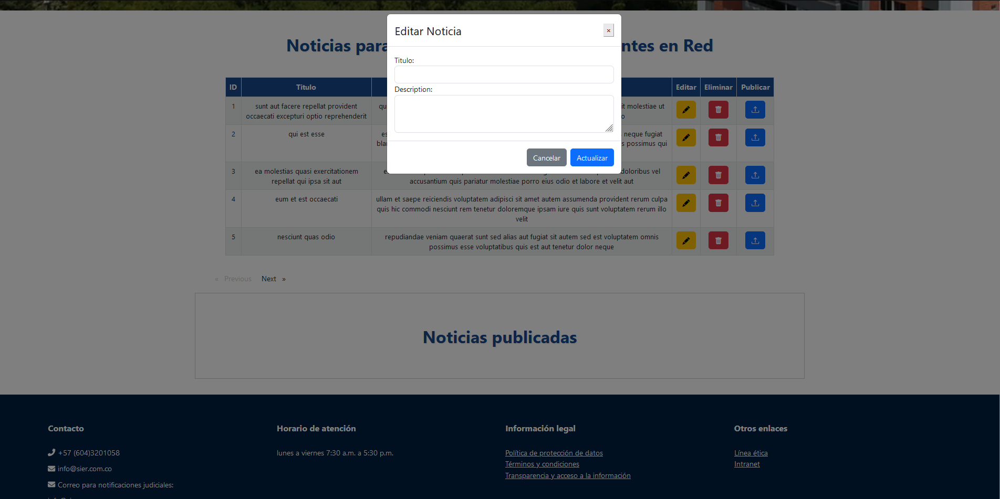
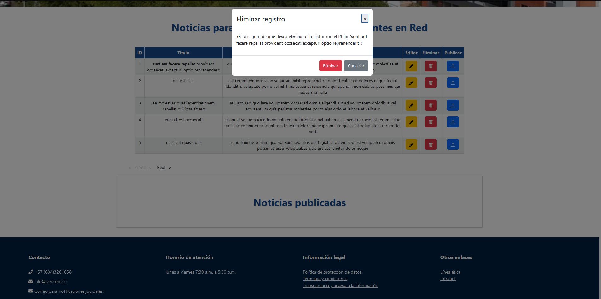
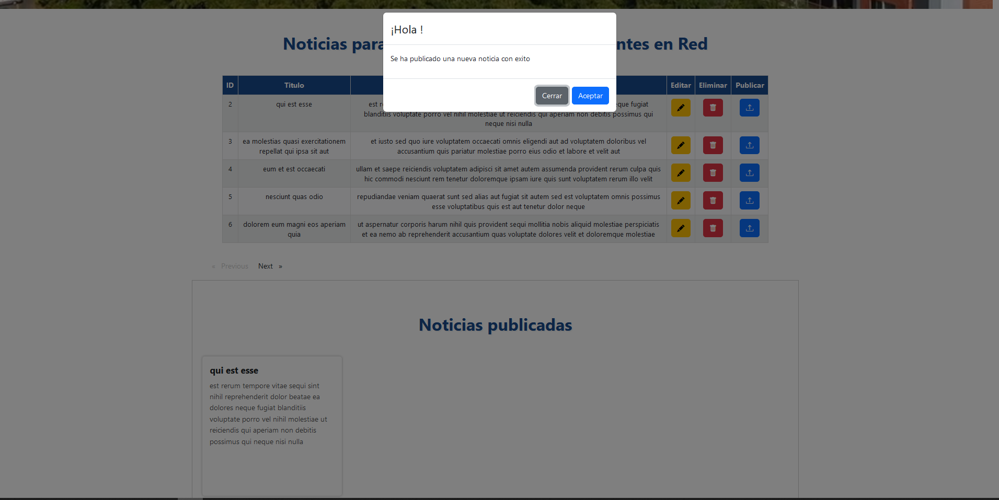
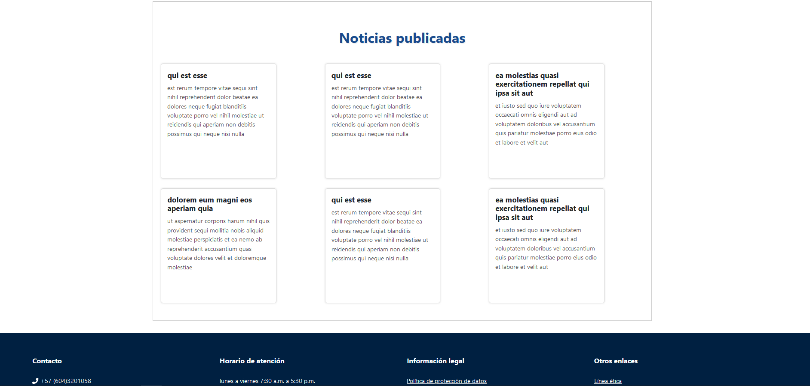
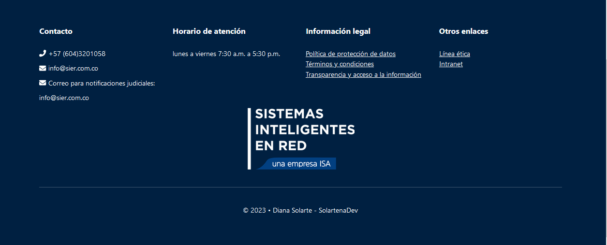

<h1 align="center"> Post de Sistemas Inteligentes en Red </h1>

 

## Tabla de contenidos:
---

- [Descripción y contexto](#descripción-y-contexto)
- [Guía de usuario](#guía-de-usuario)
- [Guía de instalación](#guía-de-instalación)
- [Cómo contribuir](#cómo-contribuir)
- [Código de conducta](#código-de-conducta)
- [Autor/es](#autores)
- [Información adicional](#información-adicional)
- [Licencia](#licencia)
- [Limitación de responsabilidades - Solo BID](#limitación-de-responsabilidades)

## Descripción y contexto
---
La aplicación consiste en una interfaz web desarrollada con Angular y Bootstrap que consume datos de una API REST llamada JSONPlaceholder. Al acceder a la página, se muestra un data table paginado que lista los posts obtenidos del servicio de la API. Cada fila del data table cuenta con un botón de eliminar, editar y publicar que permite una acción del post correspondiente. Además, hay formularios para publicar y actualizar posts que se muestran en modales al hacer clic en los botones correspondientes. La aplicación también cuenta con una barra lateral con enlaces a diferentes secciones de la página. Se han tenido en cuenta buenas prácticas de desarrollo y se ha documentado el código de forma clara y concisa.

## Guía de usuario
---
La aplicación se identifica con el icono que se muestra a continuación:

 

La interfaz se mostrará de esta manera: En la cual se podra visualizar un nav-bar estatico y un video de banner para conceptualizar la identidad de la marca

 

La interfaz se mostrará de esta manera: En la cual se podra visualizar una data-table al realizar scroll hacía abajo el diseño se desarrollo aplicando diseño UX -UI teniendo en cuenta los colores corporativos de la marca. Se determinaron los siguientes : #184A8C #0E4473 #18A2D9 #14B5D9 #F2F2F2

 

La interfaz se mostrará de esta manera: En la cual se podra visualizar una data-table en la cual al presionar el boton amarillo de "Editar" se desplegara un modal de formulario el cual tendrá un formulario que permite actualizar los datos del objeto seleccionado

La interfaz se mostrará de esta manera: En la cual se podra visualizar una data-table en la cual al presionar el boton rojo de "Eliminar" se desplegara un modal en  el cual tendrá una pregunta para saber si el usuario esta seguro de eliminar el post del objeto seleccionado

La interfaz se mostrará de esta manera: En la cual se podra visualizar una data-table en la cual al presionar el boton azul de "Publicar" se desplegara un modal en  el cual muestra un mensaje que se creó correctamente la noticia del objeto seleccionado

La interfaz se mostrará de esta manera: En la cual se podra visualizar una data-table y debajo de está se podra visualizar la seccion de "noticias" en la cual se visualizaran en orden los post publicados

La interfaz se mostrará de esta manera: En la cual se podra visualizar el Footer en el cual se agrego información relevante de la marca corporativa y de facil acceso para los usuarios.

### Guía de instalación
---
 ### Arquitectura de carpetas y módulos:

 La arquitectura de la aplicación de Angular contiene las siguientes aplicaciones y servicios:

  - Edit-modal : Esta carpeta contiene el componente ModalEditComponent, que se utiliza para mostrar el modal de edición. Este componente se encarga de obtener los  datos del post seleccionado y mostrarlos en un formulario para que el usuario pueda editarlos. Una vez que el usuario envía el formulario, el componente emite un   evento con los datos actualizados del post para que el componente padre (app.component) los procese.
  
  - Footer : Esta carpeta contiene el componente FooterComponet, que se utiliza para mostrar para incluir información importante de la empresa o del sitio web, como los datos de contacto. Este componente se encarga de mostrar información adicional y enlaces.
  
  - Modal : Los modales son ventanas emergentes que se utilizan para mostrar información adicional o para solicitar confirmación al usuario antes de realizar una acción. En tu aplicación, utilizaste dos modales: el modal de edición y el modal de publicación. Ambos modales se implementaron utilizando la biblioteca ngx-bootstrap, que proporciona componentes de Bootstrap para Angular. Puedes encontrar más información sobre los modales de ngx-bootstrap en su documentación oficial: https://valor-software.com/ngx-bootstrap/#/modals.
  
  - pipes :  Los pipes son transformaciones que se aplican a los datos en tiempo real en la vista de Angular. En tu aplicación, utilizaste el pipe SlicePipe para paginar los resultados de la tabla. Este pipe toma un array y devuelve una porción de ese array, según los parámetros que se le proporcionen. Puedes encontrar más información sobre los pipes en la documentación oficial de Angular: https://angular.io/guide/pipes.
  
  - Post-modal : Esta carpeta contiene el componente ModalPostComponent, que se utiliza para mostrar el modal de publicación. Este componente se encarga de mostrar un formulario vacío para que el usuario pueda ingresar los datos de un nuevo post. Una vez que el usuario envía el formulario, el componente emite un evento con los datos del nuevo post para que el componente padre (app.component) los procese.
  
  - Services JSONPlaceholder : Los servicios son clases que se utilizan para realizar peticiones HTTP y obtener datos de una API. En tu aplicación, utilizaste el servicio PostService para obtener los datos de los posts desde la API JSONPlaceholder. Este servicio utiliza el módulo HttpClient de Angular para realizar las peticiones HTTP. Puedes encontrar más información sobre los servicios y HttpClient en la documentación oficial de Angular: https://angular.io/guide/http.
  
  - Sidebar : La sidebar es un componente que se utiliza para mostrar información adicional o para navegar a otras secciones de la aplicación. En tu aplicación, utilizaste la sidebar para mostrar un menú de navegación con opciones para ver los posts y para crear un nuevo post. La sidebar se implementó utilizando componentes de Bootstrap y Angular. Puedes encontrar más información sobre la implementación de la sidebar en la documentación oficial de Bootstrap: https://getbootstrap.com/docs/5.0/components/offcanvas/.

  - Table : La tabla es un componente que se utiliza para mostrar datos en forma de tabla. En tu aplicación, utilizaste la tabla para mostrar los posts obtenidos desde la API JSONPlaceholder. La tabla se implementó utilizando componentes de Bootstrap y Angular. Puedes encontrar más información sobre la implementación de la tabla en la documentación oficial de Bootstrap: https://getbootstrap.com/docs/5.0/content/tables/.

  - Assets: Esta carpeta contiene el componente ModalEditComponent, que se utiliza para mostrar el modal de edición. Este componente se encarga de obtener      los  datos del post seleccionado y mostrarlos en un formulario para que el usuario pueda editarlos. Una vez que el usuario envía el formulario, el componente    emite un  evento con los datos actualizados del post para que el componente padre (app.component) los procese.

La guía de instalación debe contener de manera específica:
- Los requisitos del sistema operativo para la compilación (versiones específicas de librerías, software de gestión de paquetes y dependencias, SDKs y compiladores, etc.).
- Las dependencias propias del proyecto, tanto externas como internas (orden de compilación de sub-módulos, configuración de ubicación de librerías dinámicas, etc.).
- Pasos específicos para la compilación del código fuente y ejecución de tests unitarios en caso de que el proyecto disponga de ellos.

### Dependencias
Descripción de los recursos externos que generan una dependencia para la reutilización de la herramienta digital (librerías, frameworks, acceso a bases de datos y licencias de cada recurso). Es una buena práctica describir las últimas versiones en las que ha sido probada la herramienta digital. 

    Puedes usar este estilo de letra diferenciar los comandos de instalación.

## Cómo contribuir
---
Esta sección explica a desarrolladores cuáles son las maneras habituales de enviar una solicitud de adhesión de nuevo código (“pull requests”), cómo declarar fallos en la herramienta y qué guías de estilo se deben usar al escribir más líneas de código. También puedes hacer un listado de puntos que se pueden mejorar de tu código para crear ideas de mejora.

## Código de conducta 
---
El código de conducta establece las normas sociales, reglas y responsabilidades que los individuos y organizaciones deben seguir al interactuar de alguna manera con la herramienta digital o su comunidad. Es una buena práctica para crear un ambiente de respeto e inclusión en las contribuciones al proyecto. 

La plataforma Github premia y ayuda a los repositorios dispongan de este archivo. Al crear CODE_OF_CONDUCT.md puedes empezar desde una plantilla sugerida por ellos. Puedes leer más sobre cómo crear un archivo de Código de Conducta (aquí)[https://help.github.com/articles/adding-a-code-of-conduct-to-your-project/]

## Autor/es
---
Nombra a el/los autor/es original/es. Consulta con ellos antes de publicar un email o un nombre personal. Una manera muy común es dirigirlos a sus cuentas de redes sociales.

## Información adicional
---
Esta es la sección que permite agregar más información de contexto al proyecto como alguna web de relevancia, proyectos similares o que hayan usado la misma tecnología.

## Licencia 
---

La licencia especifica los permisos y las condiciones de uso que el desarrollador otorga a otros desarrolladores que usen y/o modifiquen la herramienta digital.

Incluye en esta sección una nota con el tipo de licencia otorgado a esta herramienta digital. El texto de la licencia debe estar incluído en un archivo *LICENSE.md* o *LICENSE.txt* en la raíz del repositorio.

Si desconoces qué tipos de licencias existen y cuál es la mejor para cada caso, te recomendamos visitar la página https://choosealicense.com/.

Si la herramienta que estás publicando con la iniciativa Código para el Desarrollo ha sido financiada por el BID, te invitamos a revisar la [licencia oficial del banco para publicar software](https://github.com/EL-BID/Plantilla-de-repositorio/blob/master/LICENSE.md)

## Limitación de responsabilidades
Disclaimer: Esta sección es solo para herramientas financiadas por el BID.

El BID no será responsable, bajo circunstancia alguna, de daño ni indemnización, moral o patrimonial; directo o indirecto; accesorio o especial; o por vía de consecuencia, previsto o imprevisto, que pudiese surgir:

i. Bajo cualquier teoría de responsabilidad, ya sea por contrato, infracción de derechos de propiedad intelectual, negligencia o bajo cualquier otra teoría; y/o

ii. A raíz del uso de la Herramienta Digital, incluyendo, pero sin limitación de potenciales defectos en la Herramienta Digital, o la pérdida o inexactitud de los datos de cualquier tipo. Lo anterior incluye los gastos o daños asociados a fallas de comunicación y/o fallas de funcionamiento de computadoras, vinculados con la utilización de la Herramienta Digital.
